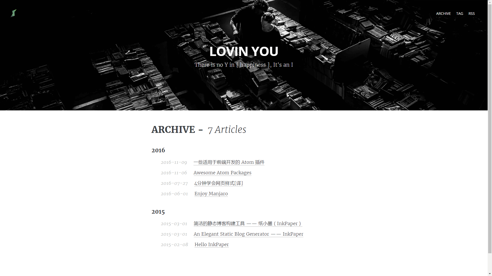

# Ink Theme Dark
The Dark theme of InkPaper. New to [InkPaper](http://www.chole.io)?

[](https://github.com/InkProject/ink-theme-dark/releases)
[](http://www.chole.io/)
[](https://creativecommons.org/licenses/by-nc/4.0/)

## How to use it
- Clone this repository
- Copy `dark` file to blog file and Change theme

  ```ymal
  site:
      title: "InkPaper"
      subtitle: "An Elegant Static Blog Generator"
      limit: 10
      theme: dark
      ...
  ```

- add **bg1.jpg** & **bg2.jpg** to blog `source/images` file as your background image

  > Don't change filenames unless you want to do more custom

- Run `ink preview`

## Preview



## FAQ
Before opening a new issue please check our [FAQ page](https://github.com/InkProject/ink-theme-dark/issues).

## Contributing
* ⇄ Pull requests and ★ Stars are always welcome.
* For bugs and feature requests, please create an [issue](https://github.com/InkProject/ink-theme-dark/issues).
* To contribute to ink-theme-dark, clone this repo locally and commit your code on a separate branch.

## License

<a rel="license" href="http://creativecommons.org/licenses/by-nc/4.0/"></a>

This Blog theme by <a xmlns:cc="http://creativecommons.org/ns#" href="http://www.shery.me" property="cc:attributionName" rel="cc:attributionURL">shery</a> is licensed under a <a rel="license" href="http://creativecommons.org/licenses/by-nc/4.0/">Creative Commons Attribution-NonCommercial 4.0 International License</a>, and the underlying source code used to format and display this Blog theme is licensed under the [MIT License](https://github.com/shery15/blog/blob/blog-source/LICENSE).
